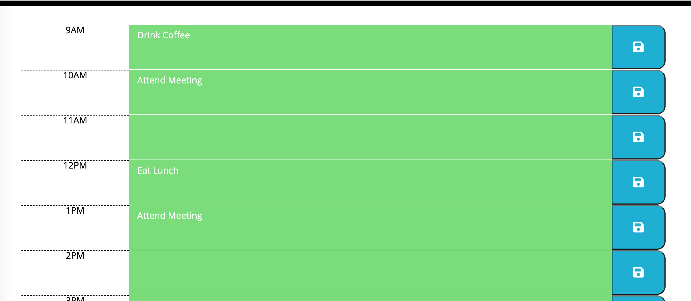

# Work Day Scheduler (Starter Code)

## Description
Featuring dynamically updated HTML and CSS using jQuery, this application serves as a work day scheduler for every hour. Using the Moment.js library, users can see what the current date is at the top and whether or not a time block is in the past, present, or future. The app is simple to use, just enter in a task or message at the respective time block. Once it is ready to save, click on the save button on the right. Tasks/Messages will then be saved in to localStorage and persist on the page even after refresh. 

## Built With
* HTML
* CSS
* JavaScript (jQuery)

## Screenshots

## Website
https://stevenmly.github.io/Work-Day-Scheduler/

## Contribution
Made with ❤️ by Steven Ly